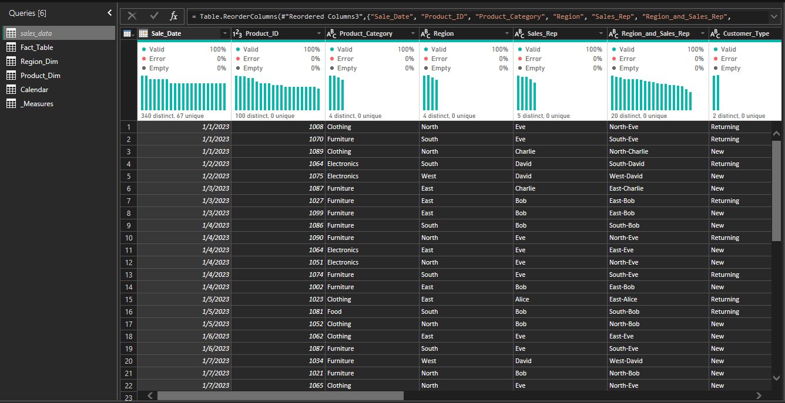
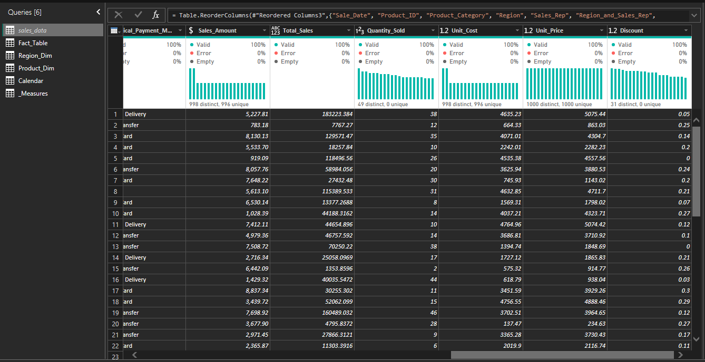
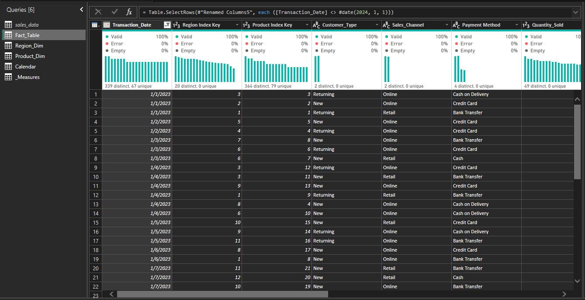
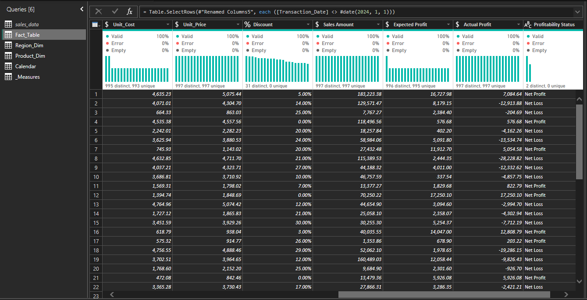
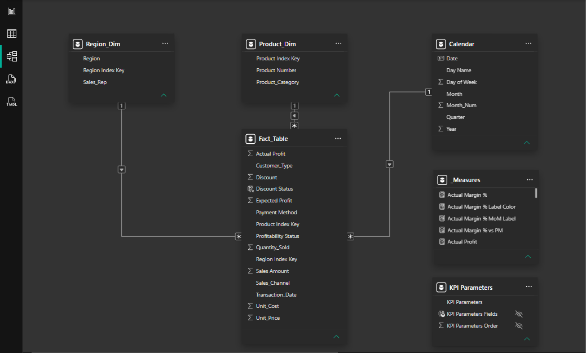
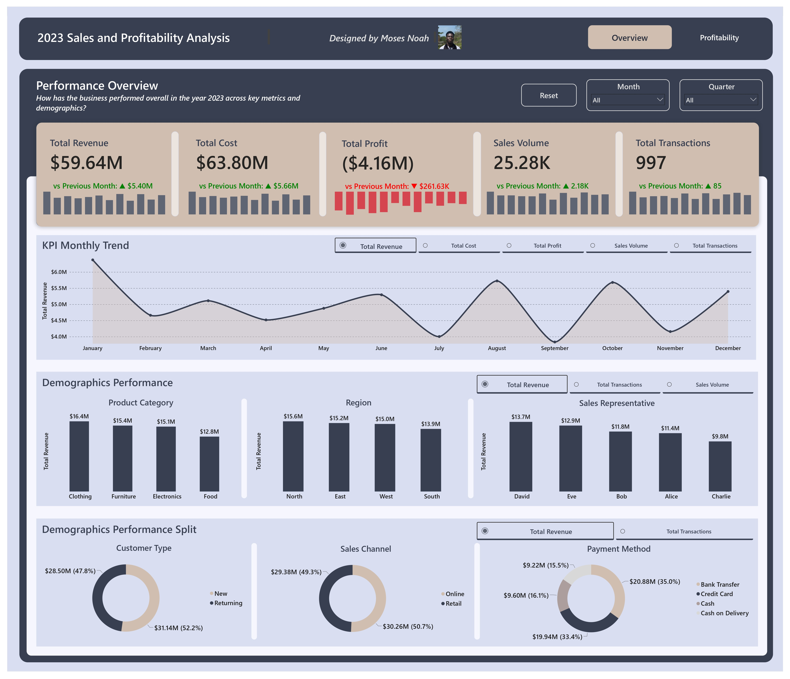
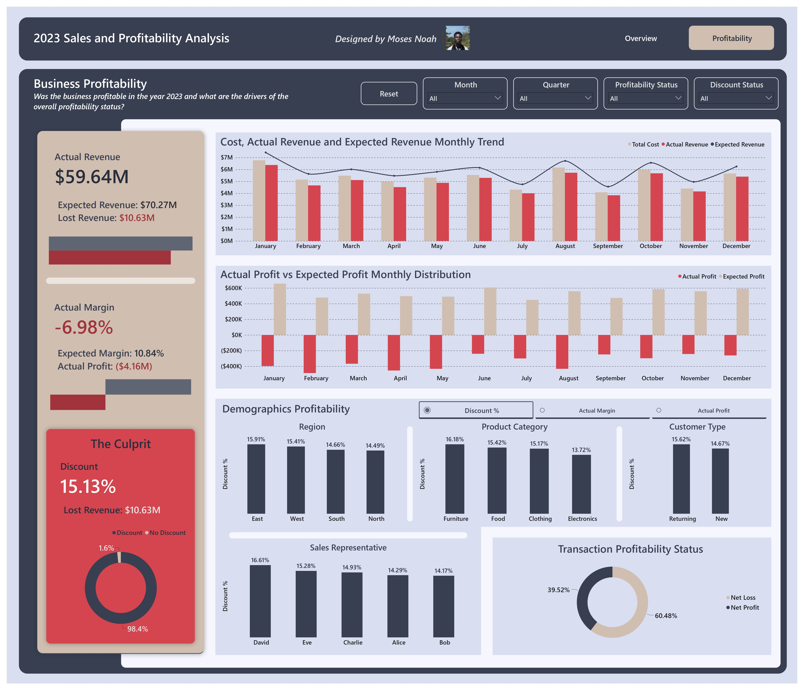

# Sales and Profitability Analysis
**By Moses Noah**

## Project Overview
This project analyzes fictional transaction and demographics data across four product categories, four physical regions and two sales channels, in order to evaluate business performance and narrow down the origin of revenue and profit leakage.

## Business Problem
A fictional commercial business specializes in the sales of multiple products grouped into Clothing, Furniture, Electronics and Food, the business also owns retail stores across several regional markets as well as an Online store. The Executive team has noticed the business is performing less than anticipated while also returning even less in profits, so they requested for an analysis into the business's performance and it's profitability.

## Data Source
The data for this project is a fictional transaction dataset that comprises 1000 transaction records featuring Transaction Dates, Products, Customer Demographics, Sales Region & Channel, Payment Methods and Financial Records.
The data was published on Kaggle by Vinoth Kanna, click this link to view the dataset: [Sales Dataset](https://www.kaggle.com/datasets/vinothkannaece/sales-dataset).

## Tools and Methodology
**Tools Used:** The raw dataset was cleaned, transformed, modeled and visualized in Power BI Desktop and published on Power BI Service.

**Data Cleaning & Transformation:** In order to prepare the raw data for analysis and maintain data integrity, the following steps were carried out:
* Recalculated Sales Amount to be logically consistent with Unit Prices, Quantity Sold and Discount.
* Normalized Region and Product data into distinct dimension queries for improved model performance.
* Changed column data types to the appropriate data types (e.g. Discount to Percentage, Price and Cost to Currency, etc).
* Restructured Payment Method to include Cash on Delivery for sales that happened online but are paid for by cash.
* Engineered a calendar table using custom M Query code in Power Query.
* Calculated Expected Profit column (profit without margin) to aid profitability analysis.
* Engineered a Profitability Status column to categorize transactions into Net Profit or Net Loss transactions.

Excerpt of raw dataset:

Excerpt of cleaned dataset:

**Calculated Fields and Measures:** The following measures were engineered in Power BI using DAX to dynamically quantify performance, each measure includes accompanying label measures for added context:
* Sales Volume
* Total Transactions
* Total Cost
* Total Revenue
* Expected Revenue
* Lost Revenue
* Discount %
* Actual Profit
* Expected Profit
* Actual margin
* Expected Margin

**Data Modelling:** The dataset was standardized into three distinct tables, Fact, Region and Product tables, with an accompanying Calendar table. The data model was structured into a Star Schema with filter directions in the following order:
* Region_Dim -> Fact_Table
* Product_Dim -> Fact_Table
* Calendar -> Fact table

**Data Visualization:** Two interactive report pages were developed, each containing multiple charts to represent business performance and profitability.
* Line Chart to show KPI trends
* KPI Cards to visualize measures and their labels
* Column charts to compare demographics performance
* Donut charts for percentage splits

The report was categorized in two pages:
1. Performance Overview
2. Business Profitability

## Report Preview
Below are images of the report pages. Follow this link to interact with the report online: [Published Report](https://app.powerbi.com/view?r=eyJrIjoiOWUxYzBkMjctMmJlMS00NzRjLWE4YWYtOWQ2ZTI5NTZiYWZlIiwidCI6ImJmZDA1N2Q1LThjNjQtNDEyNi1iOGQ3LTFkOGUxMWI4NGU5YSJ9).

* **Performance Overview**

* **Business Profitability**

## Insights
**Executive Overview:**
* January saw the highest performance with 100 transactions selling 2.4K units and generating $6.37M in revenue, while September contributed the least revenue at $3.84M, 66.2% lesser than January.
* With the first half of the year contributing $30.84M and the second half contributing $28.80M in revenue, this suggests the business performs its best during the first half of the year.
* Clothing contributed the most revenue at $16.4M while Food contributed the least at $12.8M. Furniture and Electronics performed comparably at $15.4 and $15.1M in revenue respectively. This indicates Clothing as a major driver of revenue performance.
* North, East and West performed comparably, contributing $15.6M, $15.2M and $15M in revenue, respectively. The South had the weakest performance at $13.9M in revenue. This suggests a stable performance across regions.
* The business reached 494 New customers, accounting for 49.5% of total transactions and contributing $28.5M in revenue. This indicates a successful customer acquisition initiative but also hints at a possible poor customer retention strategy.
* Both sales channels performed comparably with the Retail channel contributing $30.26M in revenue (50.7%), while Online channel contributed $29.38M in revenue (49.3%). This indicates the Online channel is a major driver of the business's performance as the Retail percentage is shared by physical stores across four regions.
* Bank Transfers and Credit Cards were the most popular payment methods, facilitating 35% and 33.4% of payments respectively while Cash and Cash on Delivery accounted for 16.1% and 15.5% respectively. This suggests the business's customer base much prefers electronic payment methods.

**Business Profitability:**
* The business incurred serious losses with a net profit margin of -6.98%, resulting in a revenue loss of $10.63M (15.13% of Expected Revenue) and a net profit of ($4.16M). This was caused by a total discount of 15.13%, originating from discounted transactions (98.4% of transactions) with discounts per transaction ranging up to 30%.
* While some discounted transactions did result in a net profit, 61.47% of discounted transactions resulted in a net loss, resulting in revenue loss of $9.20M (13.09% of Expected Revenue). This conclusively indicates that Discounts is the sole reason for the business's negative profitability.
* Returning customers enjoyed a higher total discount at 15.62%, compared to 14.67% for New customers. While discounts might've successfully captured new customers, it yielded negative returns in revenue performance and paired with a possible poor customer retention strategy, this suggests a much poorer performance in the long run.
* Higher performing demographics also gave a higher discount compared to others, this indicates a negative correlation between discounts and sales performance.

## Recommendations
* **Improve visibility in the South:** While performance in the South wasn't drastic, the business should consider improving promotion efforts in the South in order to improve the business's visibility. This could lead to improved performance in the South.
* **Redesign discount strategy:** With a current revenue loss of $10.63M due to unstructured and excessive discounts, the business needs to revamp its discount strategy. The business should consider implementing a tiered discount strategy where customers are grouped into tiers and awarded discounts based on their respective tier. This new discount strategy should also fall within the confines of the business's profit margin, this avoids excessive discounting beyond the business's profit margin.
* **Improve customer retention:** The business reached a total of 494 new customers (49.5% of customers in the calendar year), this shows the business is currently effective at capturing new customers. In order to improve performance in the coming years, the business should improve its customer retention strategy. This can be achieved through a structured customer tier program that incentivize customers with discounts and access advantage.

## Limitations
* The dataset accounts only for the business's transaction records and performance, external factors such as economic conditions, overall market conditions and/or competitor activity were not incorporated in the analysis.
* The dataset lacks granular features in the Product and Region dimensions such as City, States, Product Names and Brands. This limits the details and scope of the analysis.

## Conclusion & Lessons
This project explores the performance of a fictional retail business and the disadvantages of an unstructured and excessive discount strategy to a business's performance and profitability. Successful implementation of the data-driven insights and recommendations from this analysis should improve business performance, profitability, customer retention, and sustain long term growth.

## Relevant Links
* **Online Report:** [Published Report](https://app.powerbi.com/view?r=eyJrIjoiOWUxYzBkMjctMmJlMS00NzRjLWE4YWYtOWQ2ZTI5NTZiYWZlIiwidCI6ImJmZDA1N2Q1LThjNjQtNDEyNi1iOGQ3LTFkOGUxMWI4NGU5YSJ9)
* **GitHub Repository:** [Moses Noah GitHub](https://github.com/moses-noah/Sales-and-Profitability-Analysis)
* **LinkedIn Profile:** [Moses Noah](https://www.linkedin.com/in/moses-noah/)
* **Portfolio Website:** [Moses Noah Portfolio](https://moses-noah.github.io/)
